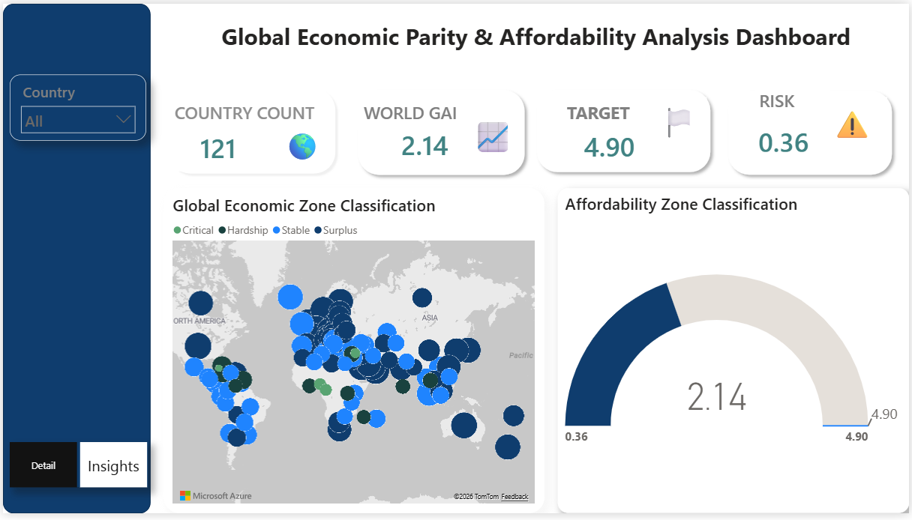

# Global-Parity: The-Affordability-Gap
## Global Parity: Navigating Wealth, Cost, and Purchasing Parity in a Fractured Economy

## Project Overview:
### Global Parity: 
The Affordability Gap Analyzed 121 nations vs. a NYC baseline to reveal the "Affordability Trap". Using advanced DAX, I visualized how low-cost economies like India offer high "Economic Leverage" , while regions like Nigeria face a "Purchasing Power Crisis" where low wages negate low costs. A study on Relative vs. Absolute Wealth.

## Glossary of Economic Terms:
- Purchasing Power Parity (PPP): This is the measure of how many units of currency are needed in one country to buy the same amount of goods and services that one unit of currency would buy in another country. Think of it as the "Universal Buying Power".
- Global Parity: This refers to the state where the value of money is equal across different borders. Our project identifies a "Gap" in this parity, showing where money is "supercharged" or "trapped".
- Relative Affordability: This isn't about how much money you have in total (Absolute Wealth), but how far your specific income goes within your local borders.
- Economic Leverage: This occurs in low-cost economies where your local purchasing power is significantly higher because the cost of essentials is a fraction of the global baseline.
- Geographic Arbitrage: This is the "hidden benefit" for people with high-value currency (like the USD) who visit low-cost regions. Their money buys significantly more there than it does at home.

## Insight 1 
The "Eureka!" moment of this project, explains  the difference between Absolute Wealth and Relative Wealth. I created a call-out box in my report titled "The Paradox of Low-Cost Economies."  A high Affordability Ratio (e.g., India at 6.03) does not necessarily mean the country is wealthier than a 'Balanced' economy like Switzerland (2.12). Instead, it reveals High Economic Leverage. In these regions, local purchasing power stretches significantly further because the cost of essential services and goods is a fraction of the global baseline (NYC). This creates a 'Surplus Economy' for the average earner within their local borders.

## Insight 2 
The Purchasing Power Crisis: Data reveals a critical disparity in Nigeria, where the Local Purchasing Power Index stands at 11. Despite having a significantly lower cost of living than the West, the gap between earnings and expenses remains a 'Critical Hardship' zone. This indicates that local wages have not kept pace with the inflation of essential goods and services. While a low Cost of Living makes Nigeria attractive for foreign currency holders, the Local Purchasing Power of 11 reveals a stark reality for residents; “wages are so low that even 'cheap' local prices remain out of reach for the average earner”. In data terms, we call this the Purchasing Power Parity (PPP) gap. 

## Technical Skills Inventory
- DAX Engineering: Developed complex measures using CALCULATE, VAR, and IF to create the dynamic "Surplus vs. Critical" table logic.
- Data Modeling: Established a NYC-indexed baseline ($1.00) to allow for "Apples-to-Apples" global comparisons.
- User Interface (UI) Design: Created a dual-pane navigation system using Buttons to separate high-level trends from granular data.
- Interactive Analytics: Implemented Synced Slicers to maintain context across pages, ensuring a seamless user journey during deep-dive analysis.
- Semantic Visualization: Applied conditional formatting and iconography to visually categorize economies into "Surplus," “Stable”, "Hardship," and "Critical" tiers.

## Data Source & Methodology
- Platform: Kaggle.
- Original Data Provider: Derived from the Numbeo Global Database.
- Baseline Metric: New York City (Index = 1.0). All global purchasing power and cost of living data are relative to this benchmark.
- Economic Framework: Analyzed 121 nations focusing on the Purchasing Power Parity (PPP) gap between how much money people have and what it actually buys them locally.

## Recommendation
- Implement a "Local Parity" pay scale for employees in countries with a Purchasing Power Index below 20 (e.g., Nigeria)
- Focus remote hiring efforts in "Surplus" regions like India, where the high Affordability Ratio (6.03) provides "High Economic Leverage" for the company.
- Introduce a floating "Inflation Stipend" for regions identified in the "Critical Zone" (e.g., Syria, Cameroon).
- Integrate an automated API feed to update the "Global Affordability Index" quarterly.

## Links
[Interactive Power BI Dashboard](https://app.powerbi.com/view?r=eyJrIjoiNTk3ZGE3YjctMmJmMi00MDE3LWFmZTEtNThlYTY2ZjNjODRkIiwidCI6IjllMDVmZmZjLTRiODctNGE3NS1hZDU3LWIyYjE4OWNiOTlhYiJ9)

